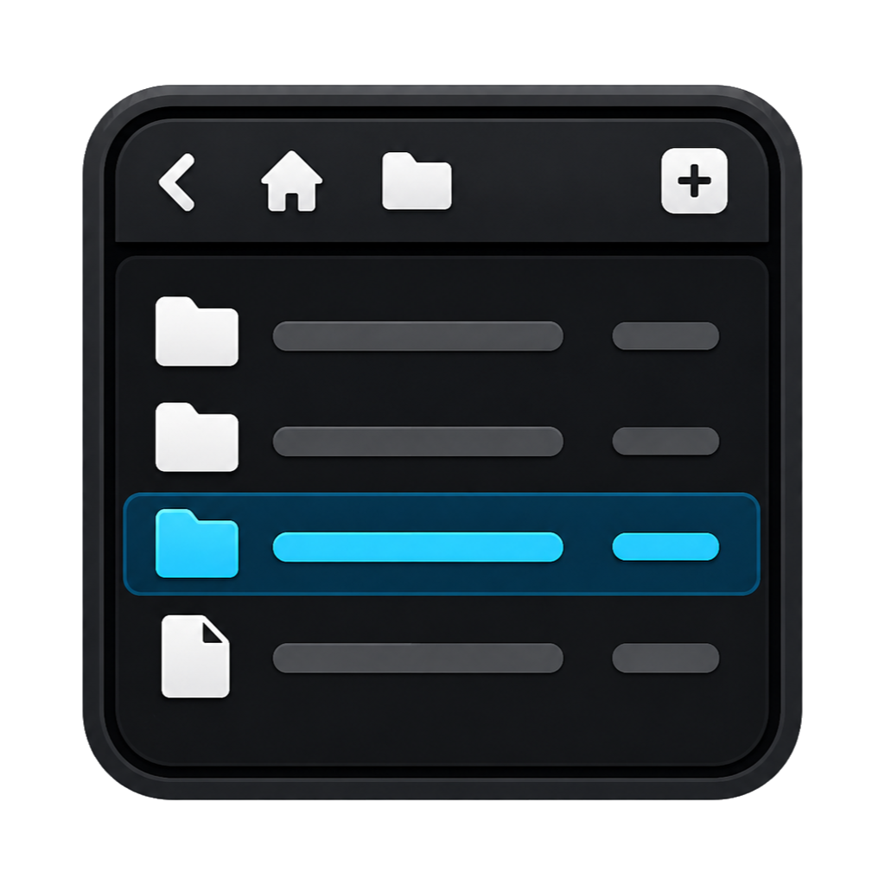

# nmf

<p>
  
</p>

nmf, short for nekomimist filer, is a proof-of-concept file manager
implemented in Go with Fyne.

The project is a desktop GUI application focused on basic file navigation,
keyboard-driven operation, configurable UI behavior, and portable path handling
across local filesystems and SMB/UNC paths.

## Current Scope

- File list navigation with keyboard and mouse input.
- Directory loading, sorting, filtering, incremental search, and navigation
  history.
- File open, rename, delete, directory creation, directory comparison, and
  copy/move jobs.
- Multi-window operation.
- Configurable theme, key bindings, external commands, and optional Starlark
  configuration.
- Local filesystem access plus ongoing SMB/UNC support for Windows and Linux.

This repository is primarily an implementation PoC, not a finished file manager
distribution.

## Requirements

- Go 1.25 or newer.
- Fyne build requirements for the target platform.
- `gcc-mingw-w64` is required for the provided Windows cross-build target,
  which uses `x86_64-w64-mingw32-gcc`.

## Build and Test

Run the application:

```sh
go run .
```

Run with debug logging:

```sh
go run . -d
```

Start in a specific directory:

```sh
go run . -path /some/dir
```

Build and test:

```sh
make build
make build-windows
make test
```

## Documentation

- [Documentation guide](docs/README.md)
- [Configuration](docs/configuration.md)
- [Starlark configuration](docs/starlark-configuration.md)
- [Architecture overview](docs/architecture/overview.md)
- [Architecture docs index](docs/architecture/README.md)
- [VFS and SMB behavior](docs/architecture/vfs-smb.md)
- [Watcher and jobs lifecycle](docs/architecture/watcher-jobs.md)
- [Keyboard and focus model](docs/architecture/ui-input.md)
- [UNC/SMB support status](docs/unc-smb-status.md)
- [Architecture risk register](docs/architecture-review.md)
