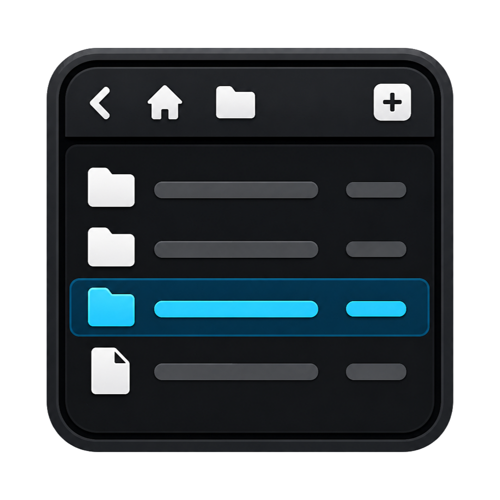
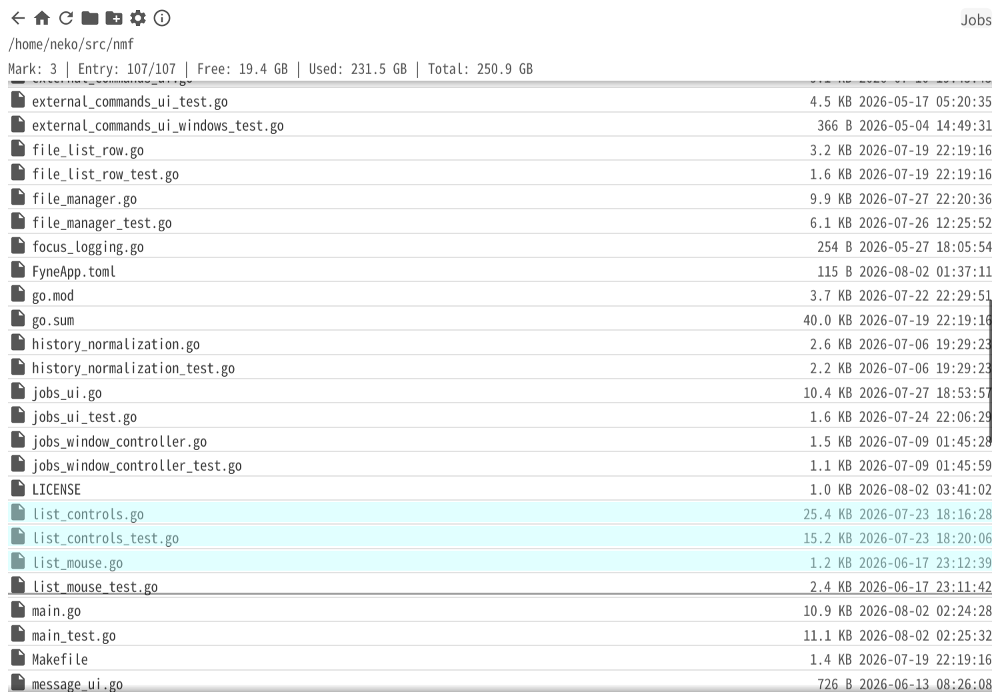
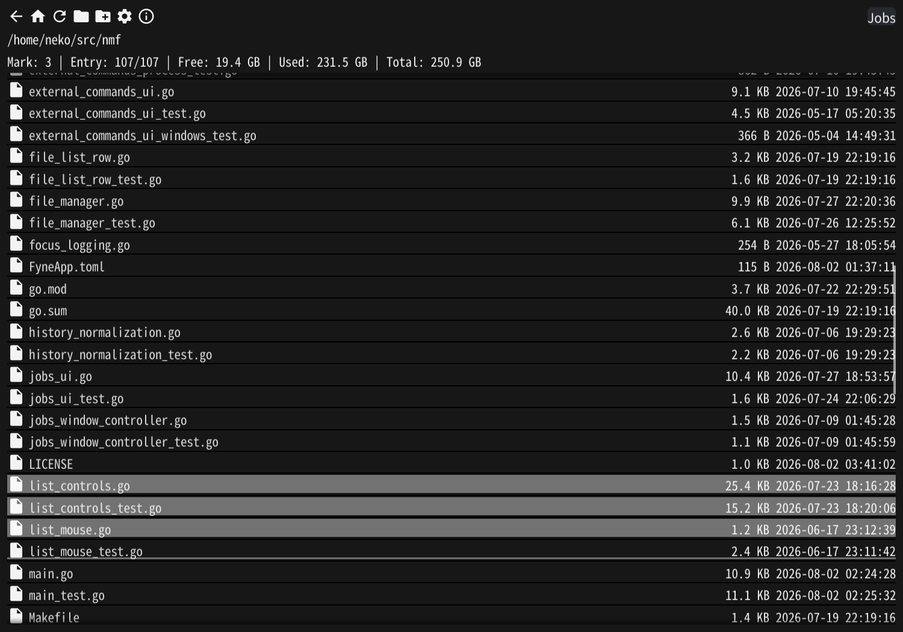
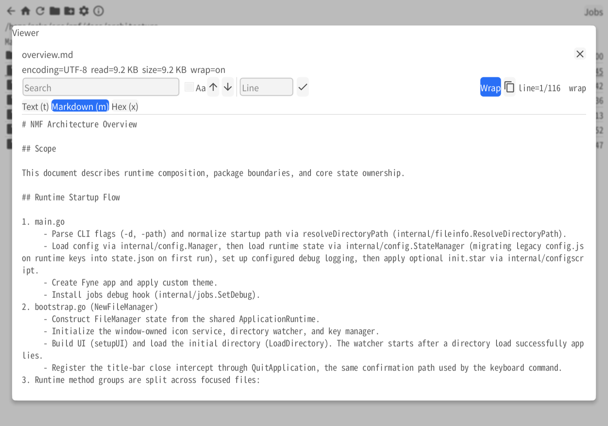
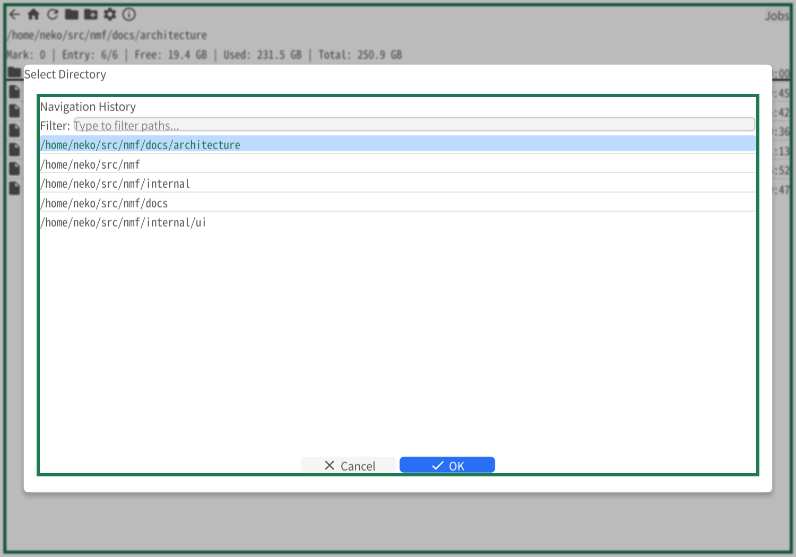
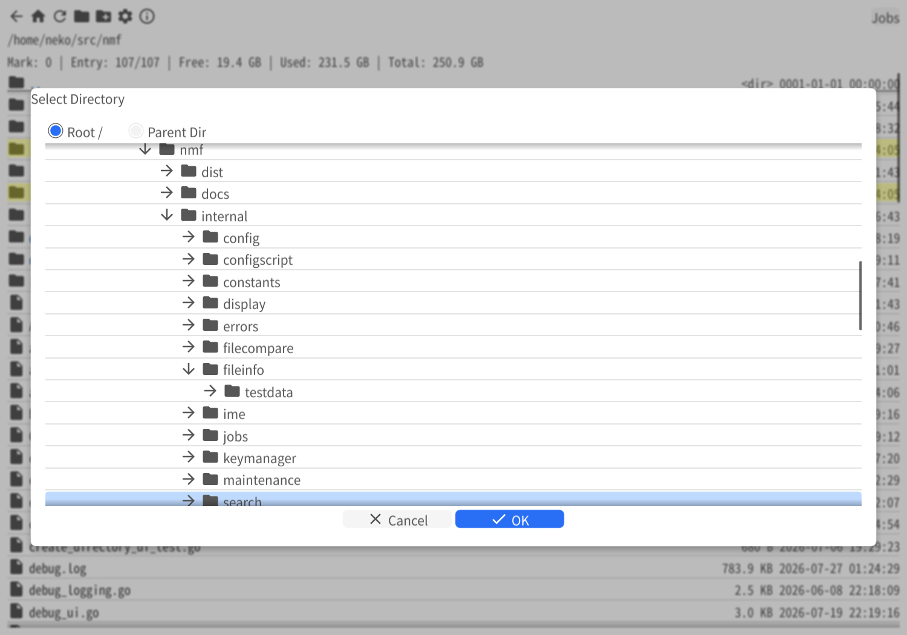

# nmf

<p>
  
</p>

nmf, short for nekomimist filer, is a keyboard-driven desktop file manager for
Windows and Linux, written in Go with [Fyne](https://fyne.io/). Everything is
reachable from the keyboard, and the mouse works too — clicking, scrolling,
drag and drop.



## Status

nmf is in daily use and covers the usual file-manager workload: browsing,
sorting, filtering, searching, copying, moving, deleting, comparing, and
previewing files, over local disks, SMB shares, and inside archives. It is no
longer a proof of concept.

Some things worth knowing before you try it:

- **It is not fast in the "written in C" sense.** It is a Go + Fyne
  application. The goal is that it never *feels* slow — large directories load
  asynchronously, icons are fetched in the background, and the list scrolls
  without stalling — not that it wins benchmarks.
- **Windows gets the full feature set.** Linux is a first-class target for
  everything except a few shell integrations that have no cross-platform
  equivalent. See [Platform support](#platform-support).
- **Breaking changes are still expected.** Configuration keys, key binding
  names, and behavior may change without a migration path. There is no stable
  release yet.
- **Most of the recent code is vibe coded.** Early development was written and
  reviewed by hand; these days the work is almost entirely done with Claude
  Code and Codex.

## Features

**Navigation and search**

- Incremental search within the current directory.
- Glob-based file filter (`doublestar` syntax) with a persistent filter history.
- Navigation history ranked by frecency, with pinned entries.
- Directory jump bookmarks configured by key.
- Per-directory cursor memory — going back to a directory restores the cursor.
- Directory tree dialog for picking a destination.
- Sorting by name, size, modification time, or extension, ascending or
  descending, with an optional directories-first rule.

**File operations**

- Copy, move, rename, create directory, delete to the OS trash, or delete
  permanently.
- Operations run through a background job queue with progress reporting and
  cancellation; the jobs window can be opened at any time.
- Directory comparison that marks entries as missing, newer, size-different, or
  content-equal.
- Same-directory rename is no-clobber where the filesystem supports flagged
  rename.

**Viewing**

- Built-in read-only viewer with Text, Markdown, Hex, and Image panes, search,
  line jump, and word wrap. There is no built-in editor — editing is delegated
  to external commands.
- Image decoding by content sniffing (PNG, JPEG, WebP, GIF, BMP, TIFF).

**Storage**

- Local filesystems.
- SMB/UNC. Windows resolves `\\server\share` and `smb://...` through native
  UNC; Linux prefers an existing CIFS mount and otherwise falls back to a
  direct SMB client. Credentials can be stored in the OS keyring.
- Read-only archive browsing as if archives were directories — ZIP, 7z, RAR,
  and tar variants (gz, bz2, xz, zst). Password-protected 7z and RAR archives
  prompt for a password and cache it in memory for the session;
  password-protected ZIP is not supported. Nested archives are not supported.

**Integration and UI**

- External command menu with per-extension entries and `{file}` / `{files}` /
  `{dir}` / `{name}` placeholders, with an optional command-line edit step.
- Multiple windows in one process, with keyboard switching between them.
- Theming: dark and light, configurable fonts including a separate monospace
  font, per-element color overrides, and cursor style.
- Live directory watching, so external changes show up without a manual reload.
- IME candidate-window anchoring for text input.

## Platform support

| | Windows | Linux |
| --- | --- | --- |
| Browsing, copy/move/rename/delete | Yes | Yes |
| SMB/UNC | Native UNC | Mounted CIFS, else direct SMB client |
| Explorer/shell context menu | Yes | Not implemented |
| Drag files out of nmf | Yes | Not implemented |
| Drop files onto nmf | Yes | Depends on the desktop backend |
| `.lnk` shortcut resolution | Yes | Not applicable |
| Native shell file icons | Yes | Theme/generic icons |
| Restore window position, place new window beside source | Yes | Window manager decides |
| Switch windows with Left/Right | Yes | X11 only; no-op on Wayland |

macOS is not a supported target. The core packages are compile-checked for
Darwin (`make test-darwin-compile`), but the GUI has never been validated
there. Details and rationale live in
[docs/architecture/platform-behavior.md](docs/architecture/platform-behavior.md).

## More screenshots

| Dark theme | Built-in viewer, Markdown pane |
| --- | --- |
|  |  |

| Navigation history, ranked by frecency | Directory tree picker |
| --- | --- |
|  |  |

## Requirements

- Go 1.25 or newer for native Linux/macOS development.
- Fyne build requirements for the target platform.
- Nix with Flakes enabled for reproducible Windows cross-builds.

## Build and run

```sh
go run -tags migrated_fynedo .                    # run
go run -tags migrated_fynedo . -d                 # run with debug logging
go run -tags migrated_fynedo . -path /some/dir    # start in a directory
```

```sh
make build          # native Linux/WSLg build: dist/nmf
make build-windows  # dist/nmf.exe; enters the Nix shell automatically
make build-windows-arm64  # dist/nmf-arm64.exe; enters the Nix shell automatically
make test           # go test ./internal/...
make test-all       # whole repository
```

The repository intentionally does not activate the Flake through `.envrc`.
Native Linux/WSLg builds must use the host GL/EGL libraries. The Windows
build and Windows compile-test targets enter the Flake through `nix develop`
when invoked outside that shell, so `make build-windows` is sufficient.

The Flake pins the Go, Zig, Fyne CLI, and native Fyne build dependencies used
by the Windows cross-builds. `flake.lock` is updated deliberately at
toolchain upgrade points; use `nix flake lock --update-input nixpkgs`, run the
build and test targets for both Windows architectures, and commit the
resulting lock file. Go module versions remain pinned by `go.mod` and
`go.sum`.

Formatting and vetting:

```sh
gofmt -s -w .
go vet -tags migrated_fynedo ./...
```

To run against an isolated set of config and history files — useful for
testing, screenshots, or a throwaway setup — pass `-profile`:

```sh
go run -tags migrated_fynedo . -profile /tmp/nmf-scratch
```

`-config-dir` and `-state-dir` override the two locations independently. See
[Data Directory Overrides](docs/configuration.md#data-directory-overrides).

## Configuration

Configuration has two layers, both optional:

- **`config.json`** — declarative settings: window geometry, theme and colors,
  fonts, sorting, viewer defaults, directory jumps, key bindings, and external
  commands. nmf only reads this file; it never writes to it.
- **`init.star`** — an optional [Starlark](https://github.com/bazelbuild/starlark)
  script in the same directory, evaluated at startup. It can set the same
  options programmatically, register custom `user.*` commands bound to keys or
  menus, and branch on hostname, OS, or environment variables. The interpreter
  is sandboxed and step-limited.

Frequently changing runtime state — cursor memory, navigation history, filter
history, last-applied sort — is kept separately in `state.json`, so editing
`config.json` by hand never fights with the running application.

Both files live in the OS configuration directory
(`$XDG_CONFIG_HOME/nekomimist/nmf/` or `%APPDATA%\nekomimist\nmf\`).

## Documentation

- [Documentation guide](docs/README.md)
- [Configuration](docs/configuration.md)
- [Starlark configuration](docs/starlark-configuration.md)
- [Architecture docs index](docs/architecture/README.md)
- [Architecture overview](docs/architecture/overview.md)
- [Platform behavior](docs/architecture/platform-behavior.md)
- [VFS and SMB behavior](docs/architecture/vfs-smb.md)
- [Watcher and jobs lifecycle](docs/architecture/watcher-jobs.md)
- [Keyboard and focus model](docs/architecture/ui-input.md)
- [Project todo](docs/todo.md)

## License

MIT. See [LICENSE](LICENSE).
